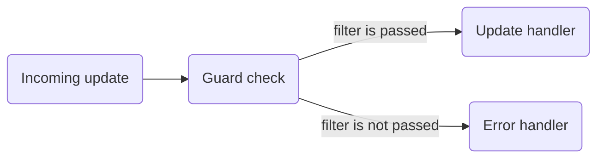

<h1 align="center">🛡 Guard for grammY</h1>

A library makes it easy to create guard middlewares, and also contains a set of
[filters](#filters) that are often used.

## Installation

### Node

```sh
npm install grammy-guard
```

### Deno

```ts
import { guard } from "https://deno.land/x/grammy_guard/mod.ts";
```

## Usage

```ts
import { Bot } from "grammy";
import { guard, isPrivateChat, reply } from "grammy-guard";

const bot = new Bot(process.env.BOT_TOKEN as string);

bot.command(
  "start",
  guard(
    isPrivateChat,
    reply("/start is only available in private chat!"),
  ),
  (ctx) => ctx.reply("Hello!"),
);

bot.start();
```

### Guard



To create a guard, pass a [filter](#filters) as the first argument and an error
handler as the second argument to `guard` constructor.

If no error handler is passed and an update does not pass the guard check, it
will be silently ignored.

```ts
import { guard, isAdmin } from "grammy-guard";

bot.on("message", guard(isAdmin), (ctx) => ctx.reply("Hello!"));
```

#### Reply with Error

To create a guard that sends an error message to a user if an update does not
satisfy the filter conditions, pass an error handler as the second argument.

```ts
import { guard, isAdmin } from "grammy-guard";

bot.on(
  "message",
  guard(isAdmin, (ctx) => ctx.reply("You are not an admin")),
  (ctx) => ctx.reply("Hello!"),
);
```

#### Universal Reply

The library also provides `reply` helper that allows you to use guards to handle
both `message` and `callback_query` updates:

```ts
import { guard, isAdmin, reply } from "grammy-guard";

const isAdminGuard = guard(isAdmin, reply("You are not an admin"));

bot.on(
  "message",
  // Error message will be sent using sendMessage method
  isAdminGuard,
  (ctx) => ctx.reply("Hello!"),
);

bot.on(
  "callback_query",
  // Error message will be sent using answerCallbackQuery method
  isAdminGuard,
  (ctx) => ctx.reply("Hello!"),
);
```

You can use the context properties for the response as well.

```ts
import { guard, isAdmin, reply } from "grammy-guard";

const isAdminGuard = guard(
  isAdmin,
  reply((ctx) => `${ctx.from?.first_name}, you are not an admin`),
);

bot.on(
  "message",
  // Error message will be sent using sendMessage method
  isAdminGuard,
  (ctx) => ctx.reply("Hello!"),
);

bot.on(
  "callback_query",
  // Error message will be sent using answerCallbackQuery method
  isAdminGuard,
  (ctx) => ctx.reply("Hello!"),
);
```

#### Combining Filters

The library provides helpers `and` and `or` for combining filters and `not` for
negation.

```ts
import { and, guard, not, or, reply } from "grammy-guard";

bot.command(
  "specific",
  guard(
    or(
      isUserHasId(1),
      isUserHasUsername("username1", "username2"),
    ),
    reply(
      "/specific only available to user with ID 1 or usernames @username1 or @username2!",
    ),
  ),
  (ctx) => ctx.reply("Hello!"),
);

bot.command(
  "admin",
  guard(
    and(isAdmin, isGroupChat),
    // same as
    // [isAdmin, isGroupChat],
    reply("/admin only available to admins in group chats!"),
  ),
  (ctx) => ctx.reply("Hello!"),
);

bot.command(
  "start",
  guard(
    and(not(isAdmin), isGroupChat),
    reply("/start only available for non-admins in group chats!"),
  ),
  (ctx) => ctx.reply("Hello!"),
);
```

### Filters

You can filter updates that satisfy the filter conditions using the `filter`
method.:

```ts
import { isUser } from "grammy-guard";

// only process updates where the message sender is a user
bot.on("message").filter(isUser, (ctx) => {
  // handle update
});
```

You can check if the context satisfies the filter conditions:

```ts
import { isUser } from "grammy-guard";

bot.on("message", (ctx) => {
  if (isUser(ctx)) {
    // the message sender is a user
  } else {
    // the message sender is not a user
  }
});
```

In both cases, the type of context will be narrowed.

#### Filters for Message Senders

<!--deno-fmt-ignore-->
- User
  - `isUser` - checks if the message sender is a user.
  - `isUserHasId(...id: number[])` - checks if the user has a given ID.
  - `isUserHasUsername(...username: string[])` - checks if the user has a given
    username.  
    _Note_: Passed values are case insensitive, usernames will be converted to lower case before comparison.
- Bot
  - `isBot` - checks if the message sender is a bot.
  - `isBotHasId(...id: number[])` - checks if the bot has a given ID.
  - `isBotHasUsername(...username: string[])` - checks if the bot has a given
    username.  
    _Note_: Passed values are case insensitive, usernames will be converted to lower case before comparison.
- Sender Chat
  - `isSenderChat` - checks if the message sender is a sender chat.
  - `isSenderChatHasId(...id: number[])` - checks if the sender chat has a given
    ID.
  - `isSenderChatHasUsername(...username: string[])` - checks if the sender chat
    has a given username.  
    _Note_: Passed values are case insensitive,
    usernames will be converted to lower case before comparison.
- `isAdmin` - checks if the message sender is an admin
- `isUserFromReply` - checks if the user is the same user who sent the message
  to which the bot replied. It is useful that only the user who called up the
  menu can use the callback buttons.

#### Filters for Chat Members

- `isChatMemberStatus(status: string)` - checks if the chat member's new status
  is a given status.
- `isMyChatMemberStatus(status: string)` - checks if the bot's new chat member
  status is a given status.

#### Filters for Chats and Channels

<!--deno-fmt-ignore-->
- `isChat` - checks if `ctx.chat` is not `undefined`.
- `isChatHasId(...id: number[])` - checks if the chat has a given ID.
- `isChatHasUsername(...username: string[])` - checks if the chat has a
  givenusername.  
  _Note_: Passed values are case insensitive, usernames will be converted to lower case before comparison.
- `isPrivateChat` - checks if it is a private chat.
- `isBasicGroup` - checks if it is a basic group chat.
- `isSupergroup` - checks if it is a supergroup chat.
- `isGroupChat` - checks if it is a basic group or a supergroup chat.
- `isChannel` - checks if it is a channel.

#### Reusing Filters

```ts
import { isUserHasId } from "grammy-guard";

const isBotOwner = isUserHasId(1337);

// only process updates from the bot owner
bot.on("message").filter(isBotOwner, (ctx) => {
  // handle update
});
```

#### Filtering by [User Requests](https://core.telegram.org/bots/features#chat-and-user-selection)

```ts
import { createUserRequestRegistry } from "grammy-guard";

const userRequests = createUserRequestRegistry()
  // .add(reason for request, identifier of request)
  .add("ban", 1)
  .add("unban", 2)

// only process updates where `user_shared.request_id` is 1
bot.filter(userRequests.filter("ban"), ctx => {
  // ctx.msg.user_shared.user_id is number
})

// only process updates where `user_shared.request_id` is 2
bot.filter(userRequests.filter("unban"), ctx => {
  // ctx.msg.user_shared.user_id is number
})

// get request id for keyboard
ctx.reply("Hello!", {
  reply_markup: new Keyboard()
    .requestUser("Ban User", userRequests.getId("ban")),
    .requestUser("Unban User", userRequests.getId("unban"))
})
```

#### Filtering by [Chat Requests](https://core.telegram.org/bots/features#chat-and-user-selection)

```ts
import { createChatRequestRegistry } from "grammy-guard";

const chatRequests = createChatRequestRegistry()
  // .add(reason for request, identifier of request)
  .add("link-chat", 1)
  .add("link-channel", 2)

// only process updates where `chat_shared.request_id` is 1
bot.filter(chatRequests.filter("link-chat"), ctx => {
  // ctx.msg.chat_shared.chat_id is number
})

// only process updates where `chat_shared.request_id` is 2
bot.filter(chatRequests.filter("link-channel"), ctx => {
  // ctx.msg.chat_shared.chat_id is number
})

// get request id for keyboard
ctx.reply("Hello!", {
  reply_markup: new Keyboard()
    .requestChat("Link Chat", chatRequests.getId("link-chat"), {
      chat_is_channel: false,
    }),
    .requestChat("Link Channel", chatRequests.getId("link-channel"), {
      chat_is_channel: true,
    })
})
```
